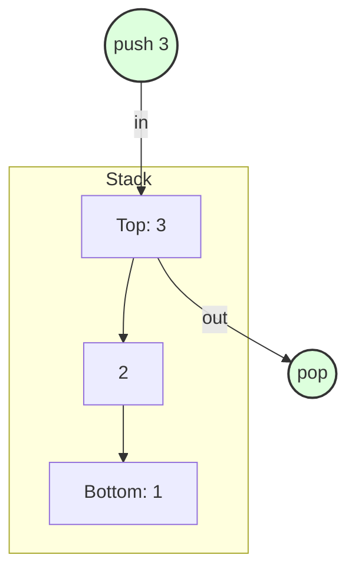
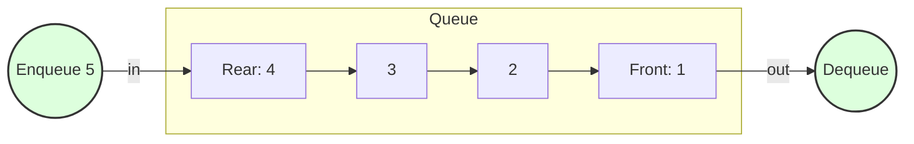
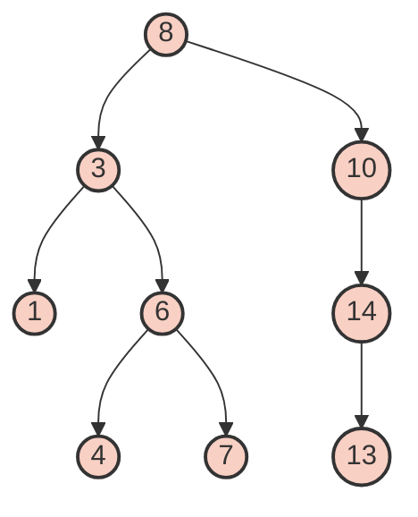
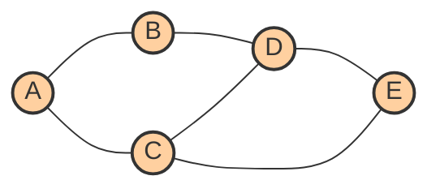
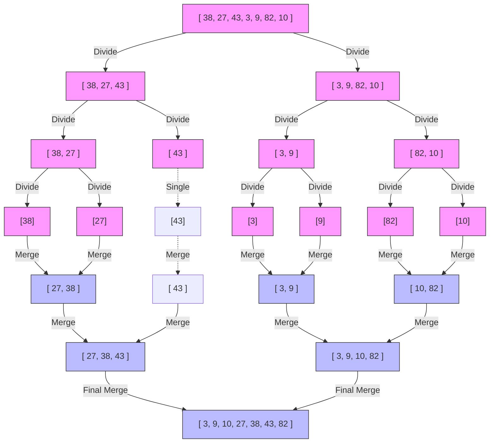
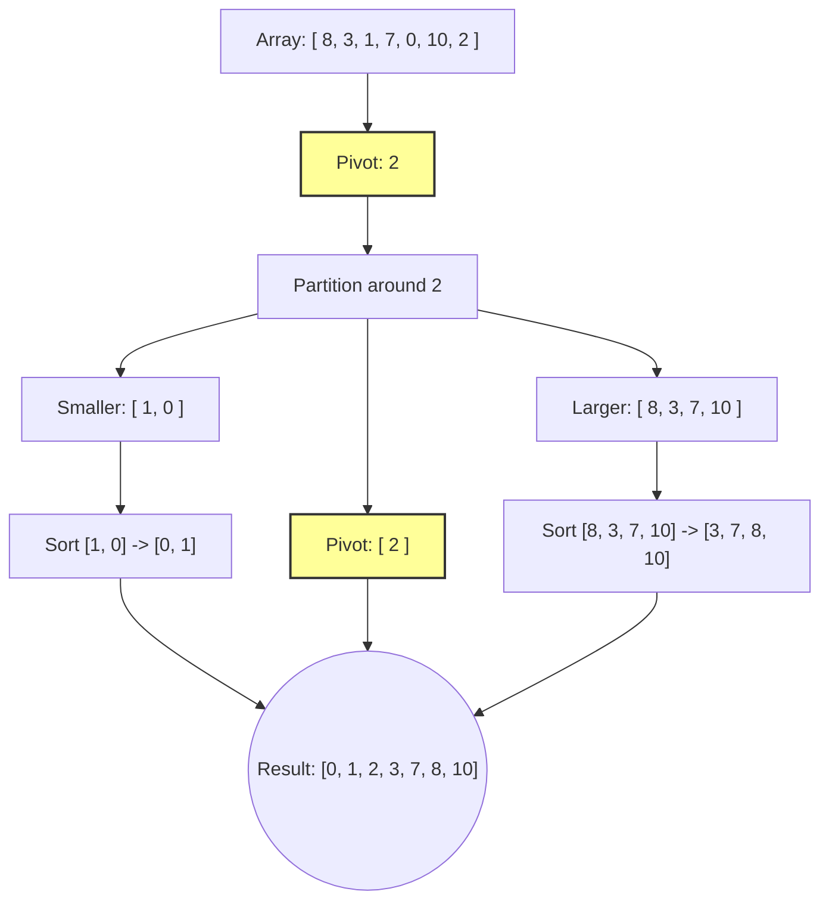
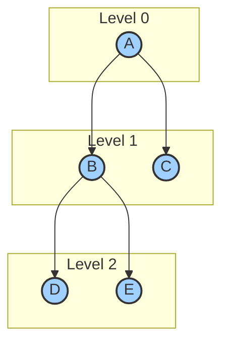
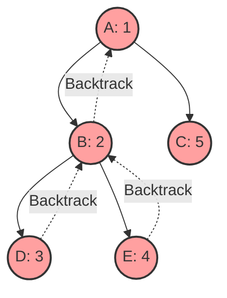

# Data Structures & Algorithms - Visual Guide

This guide provides ASCII visualizations of core data structures and algorithms to help you build solid mental models of how they operate under the hood.

---

## 1. Data Structures

### Linked List
A sequential collection of nodes, where each node points to the next.

**Singly Linked List:**
```mermaid
graph LR
    Head((Head)) --> N1[Data | Next]
    N1 --> N2[Data | Next]
    N2 --> N3[Data | Next]
    N3 --> Null((null))
    
    classDef node fill:#f9f,stroke:#333,stroke-width:2px;
    class N1,N2,N3 node;
```

**Doubly Linked List:**
```mermaid
graph LR
    Null1((null)) <-- Prev --> N1[Prev | Data | Next]
    N1 <-- Prev/Next --> N2[Prev | Data | Next]
    N2 <-- Prev/Next --> N3[Prev | Data | Next]
    N3 --> Null2((null))
    
    classDef node fill:#bbf,stroke:#333,stroke-width:2px;
    class N1,N2,N3 node;
```

### Stack (LIFO - Last In, First Out)
Elements are added and removed from the "top".



### Queue (FIFO - First In, First Out)
Elements are added at the "rear" and removed from the "front".



### Binary Search Tree (BST)
A tree where the left child is smaller than the parent, and the right child is larger.



### Graph (Adjacency Representation)
A non-linear data structure consisting of nodes (vertices) and edges.



### Hash Table
Key-value storage using a hash function, with collision resolution via chaining (Linked List).

```mermaid
graph LR
    subgraph Array/Buckets
        B0[0]
        B1[1]
        B2[2]
        B3[3]
    end

    subgraph Linked Lists (Chains)
        N1["'apple': 5"]
        N2["'banana': 2"]
        N3["'orange': 8"]
        N4["'grape': 1"]
    end

    B0 --> N1
    N1 --> N2
    B2 --> N3
    B3 --> N4
```

---

## 2. Algorithms

### Binary Search
Finding an element in a sorted array by repeatedly dividing the search interval in half.

**Searching for `7`:**
```mermaid
graph TD
    subgraph Step 1: L=0, Mid=4, R=8
    A1[1] --- A2[3] --- A3[4] --- A4[6] --- A5((7:Mid)) --- A6[8] --- A7[10] --- A8[13] --- A9[14]
    end
    
    subgraph Step 2: L=4, Mid=6, R=8
    B1((7:L)) --- B2[8] --- B3((10:Mid)) --- B4[13] --- B5((14:R))
    end
    
    subgraph Step 3: L=4, Mid=4, R=5
    C1(((7:Match!))) --- C2((8:R))
    end

    Step1 -->|6 < 7: Search Right| Step2
    Step2 -->|10 > 7: Search Left| Step3
    
    classDef match fill:#0f0,stroke:#333,stroke-width:3px;
    class C1 match;
```

### Merge Sort (Divide & Conquer)
Recursively divide the array into halves until each has one element, then merge them in sorted order.



### Quick Sort
Pick a "pivot" and partition the array around it, recursively sorting the sub-arrays.



### Graph Traversal: Breadth-First Search (BFS)
Explores the neighbor nodes first, before moving to the next level neighbors. Uses a Queue.



### Graph Traversal: Depth-First Search (DFS)
Explores as far as possible along each branch before backtracking. Uses a Stack (or recursion).

