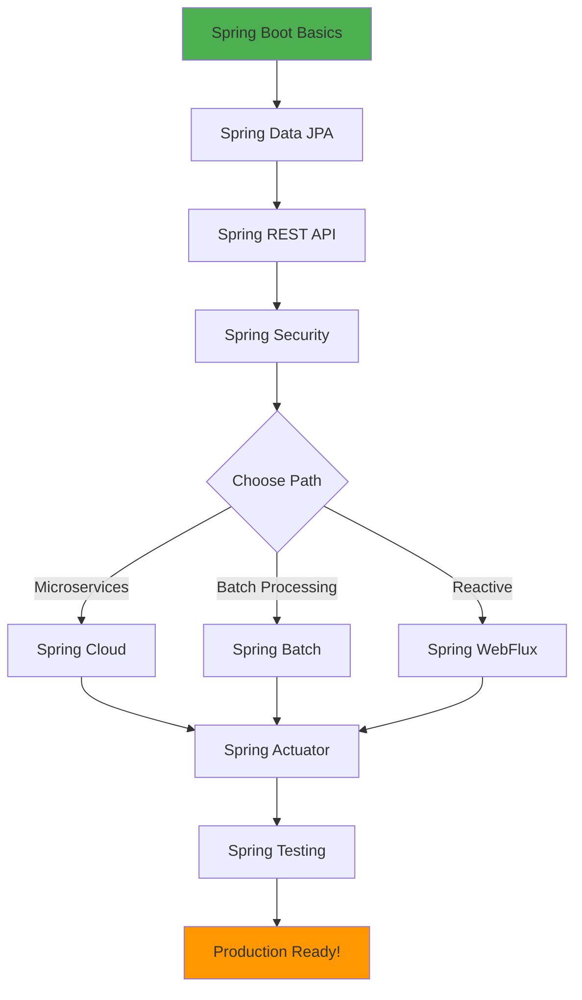

# 🍃 Spring Boot - Complete Learning Path

<div align="center">


**Master Spring Boot from basics to production-ready microservices**

</div>

---

## 🎯 Overview

This comprehensive section covers the entire Spring Boot ecosystem, from basic application setup to advanced cloud-native microservices with Spring Cloud.

---

## 📋 Module List

### 1️⃣ [Spring Boot Basics](./01-spring-boot-basics)
**Duration:** 6-8 hours | **Difficulty:** 🟢 Beginner

Get started with Spring Boot:
- Spring Boot fundamentals
- Auto-configuration
- Dependency Injection
- Application properties
- Spring Boot starters
- DevTools

**Key Topics:**
- ✅ Spring Boot architecture
- ✅ Dependency injection with @Autowired
- ✅ Configuration management
- ✅ Spring Boot CLI

**Project:** Simple REST API with CRUD operations

---

### 2️⃣ [Spring Data JPA](./02-spring-data-jpa)
**Duration:** 8-10 hours | **Difficulty:** 🟡 Intermediate

Master database operations:
- JPA and Hibernate
- Entity relationships
- Repository pattern
- Query methods
- Specifications
- Pagination and sorting

**Key Topics:**
- ✅ Entity mapping
- ✅ Repository interfaces
- ✅ Custom queries with @Query
- ✅ Transaction management

**Project:** E-commerce product catalog with database

---

### 3️⃣ [Spring Security](./03-spring-security)
**Duration:** 10-12 hours | **Difficulty:** 🔴 Advanced

Secure your applications:
- Authentication and Authorization
- JWT tokens
- OAuth2 and OpenID Connect
- Method security
- CORS configuration
- Security best practices

**Key Topics:**
- ✅ User authentication
- ✅ Role-based access control
- ✅ JWT implementation
- ✅ OAuth2 integration

**Project:** Secure banking API with JWT authentication

---

### 4️⃣ [Spring REST API](./04-spring-rest-api)
**Duration:** 8-10 hours | **Difficulty:** 🟡 Intermediate

Build production-ready REST APIs:
- RESTful principles
- Request/Response handling
- Exception handling
- Validation
- HATEOAS
- API documentation (Swagger/OpenAPI)

**Key Topics:**
- ✅ REST controllers
- ✅ Request mapping
- ✅ Exception handling with @ControllerAdvice
- ✅ API versioning

**Project:** Task management REST API

---

### 5️⃣ [Spring Cloud](./05-spring-cloud)
**Duration:** 12-15 hours | **Difficulty:** 🔴 Advanced

Build microservices architecture:
- Service discovery (Eureka)
- API Gateway (Spring Cloud Gateway)
- Config Server
- Circuit Breaker (Resilience4j)
- Distributed tracing
- Load balancing

**Key Topics:**
- ✅ Microservices patterns
- ✅ Service registration and discovery
- ✅ Centralized configuration
- ✅ Fault tolerance

**Project:** E-commerce microservices system

---

### 6️⃣ [Spring Batch](./06-spring-batch)
**Duration:** 8-10 hours | **Difficulty:** 🟡 Intermediate

Process large datasets:
- Batch processing concepts
- Job and Step configuration
- ItemReader, ItemProcessor, ItemWriter
- Chunk processing
- Job scheduling
- Error handling

**Key Topics:**
- ✅ Batch job configuration
- ✅ Data processing pipelines
- ✅ Job scheduling with @Scheduled
- ✅ Batch monitoring

**Project:** CSV data import/export system

---

### 7️⃣ [Spring Integration](./07-spring-integration)
**Duration:** 8-10 hours | **Difficulty:** 🟡 Intermediate

Enterprise integration patterns:
- Message channels
- Message endpoints
- Integration flows
- File adapters
- JMS integration
- Email integration

**Key Topics:**
- ✅ Enterprise Integration Patterns
- ✅ Message-driven architecture
- ✅ Channel adapters
- ✅ Integration DSL

**Project:** Order processing integration system

---

### 8️⃣ [Spring WebFlux](./08-spring-webflux)
**Duration:** 10-12 hours | **Difficulty:** 🔴 Advanced

Reactive programming with Spring:
- Reactive programming concepts
- Project Reactor
- Reactive REST APIs
- WebClient
- Reactive database access
- Backpressure handling

**Key Topics:**
- ✅ Mono and Flux
- ✅ Reactive streams
- ✅ Non-blocking I/O
- ✅ Reactive repositories

**Project:** Real-time stock price streaming API

---

### 9️⃣ [Spring Actuator](./09-spring-actuator)
**Duration:** 6-8 hours | **Difficulty:** 🟡 Intermediate

Monitor and manage applications:
- Health checks
- Metrics collection
- Application info
- Custom endpoints
- Prometheus integration
- Grafana dashboards

**Key Topics:**
- ✅ Built-in endpoints
- ✅ Custom health indicators
- ✅ Metrics and monitoring
- ✅ Production-ready features

**Project:** Monitored microservice with dashboards

---

### 🔟 [Spring Testing](./10-spring-testing)
**Duration:** 8-10 hours | **Difficulty:** 🟡 Intermediate

Test Spring applications:
- Unit testing with JUnit 5
- Integration testing
- MockMvc for REST testing
- TestContainers
- Mocking with Mockito
- Test slices

**Key Topics:**
- ✅ @SpringBootTest
- ✅ @WebMvcTest
- ✅ @DataJpaTest
- ✅ Test containers

**Project:** Fully tested e-commerce API

---

## 🚀 Getting Started

### Prerequisites
```bash
☕ Java 17+ (LTS recommended)
📦 Maven 3.8+ or Gradle 7+
🐳 Docker Desktop
🔧 IDE (IntelliJ IDEA Ultimate recommended)
🐘 PostgreSQL (optional, can use H2)
```

### Quick Start
```bash
# Create a new Spring Boot project
spring init --dependencies=web,data-jpa,h2 my-app
cd my-app

# Run the application
./mvnw spring-boot:run

# Or with Gradle
./gradlew bootRun
```

### Using Spring Initializr
Visit [start.spring.io](https://start.spring.io) and select:
- Project: Maven
- Language: Java
- Spring Boot: 3.2.x (latest stable)
- Java: 17 or 21
- Dependencies: Web, Data JPA, H2, Lombok

---

## 📊 Learning Path



---

## 🎯 Learning Objectives

By completing this section, you will:

✅ Build production-ready Spring Boot applications  
✅ Implement secure REST APIs with Spring Security  
✅ Work with databases using Spring Data JPA  
✅ Create microservices with Spring Cloud  
✅ Process large datasets with Spring Batch  
✅ Build reactive applications with WebFlux  
✅ Monitor applications with Spring Actuator  
✅ Write comprehensive tests for Spring apps  
✅ Deploy Spring Boot to cloud platforms  
✅ Follow Spring Boot best practices  

---

## 🏆 Major Projects

### 1. **Task Management System** (Modules 1-4)
- REST API with CRUD operations
- User authentication and authorization
- Database persistence
- API documentation

### 2. **E-commerce Platform** (Modules 2-5)
- Product catalog service
- Order management service
- User service
- API Gateway
- Service discovery

### 3. **Data Processing Pipeline** (Module 6)
- CSV file processing
- Database batch operations
- Scheduled jobs
- Error handling and retry

### 4. **Real-time Notification System** (Modules 7-8)
- Reactive WebSocket connections
- Message-driven architecture
- Real-time data streaming
- Event processing

### 5. **Production Monitoring Dashboard** (Module 9)
- Health checks
- Metrics collection
- Custom dashboards
- Alerting system

---

## 📚 Spring Boot Architecture

```
┌─────────────────────────────────────────────────────────┐
│                   Spring Boot Application                │
├─────────────────────────────────────────────────────────┤
│  ┌──────────────┐  ┌──────────────┐  ┌──────────────┐ │
│  │ Controllers  │  │   Services   │  │ Repositories │ │
│  │  (@RestAPI)  │→ │  (Business)  │→ │    (Data)    │ │
│  └──────────────┘  └──────────────┘  └──────────────┘ │
├─────────────────────────────────────────────────────────┤
│                    Spring Framework                      │
│  ┌──────────────┐  ┌──────────────┐  ┌──────────────┐ │
│  │   Security   │  │     Data     │  │     Web      │ │
│  │   (Auth)     │  │    (JPA)     │  │    (MVC)     │ │
│  └──────────────┘  └──────────────┘  └──────────────┘ │
├─────────────────────────────────────────────────────────┤
│                  Auto-Configuration                      │
│              (Spring Boot Magic ✨)                      │
└─────────────────────────────────────────────────────────┘
```

---

## 🛠️ Essential Spring Boot Annotations

### Core Annotations
```java
@SpringBootApplication  // Main application class
@RestController        // REST API controller
@Service              // Business logic layer
@Repository           // Data access layer
@Component            // Generic Spring component
@Configuration        // Configuration class
```

### Dependency Injection
```java
@Autowired            // Inject dependencies
@Qualifier            // Specify bean to inject
@Value                // Inject property values
@ConfigurationProperties  // Bind properties to POJO
```

### Web Layer
```java
@GetMapping           // HTTP GET
@PostMapping          // HTTP POST
@PutMapping           // HTTP PUT
@DeleteMapping        // HTTP DELETE
@RequestBody          // Request body binding
@PathVariable         // URL path variable
@RequestParam         // Query parameter
```

### Data Layer
```java
@Entity               // JPA entity
@Table                // Database table
@Id                   // Primary key
@GeneratedValue       // Auto-generated value
@OneToMany            // One-to-many relationship
@ManyToOne            // Many-to-one relationship
```

---

## 📖 Additional Resources

### Official Documentation
- [Spring Boot Reference](https://docs.spring.io/spring-boot/docs/current/reference/html/)
- [Spring Framework Documentation](https://docs.spring.io/spring-framework/docs/current/reference/html/)
- [Spring Guides](https://spring.io/guides)

### Books
- "Spring Boot in Action" by Craig Walls
- "Spring Microservices in Action" by John Carnell
- "Pro Spring Boot 2" by Felipe Gutierrez

### Online Courses
- [Spring Framework Guru](https://springframework.guru/)
- [Baeldung Spring Tutorials](https://www.baeldung.com/spring-boot)
- [Spring Academy](https://spring.academy/)

### Community
- [Spring Community](https://spring.io/community)
- [Stack Overflow - Spring Boot](https://stackoverflow.com/questions/tagged/spring-boot)
- [Reddit r/SpringBoot](https://reddit.com/r/SpringBoot)

---

## 🔧 Development Tools

### IDEs
- **IntelliJ IDEA Ultimate** (Recommended)
- **Eclipse with Spring Tools**
- **VS Code with Spring Boot Extension**

### Build Tools
- **Maven** (Most common)
- **Gradle** (Modern alternative)

### Testing Tools
- **JUnit 5** (Unit testing)
- **Mockito** (Mocking)
- **TestContainers** (Integration testing)
- **REST Assured** (API testing)

### Monitoring Tools
- **Spring Boot Actuator**
- **Prometheus** (Metrics)
- **Grafana** (Dashboards)
- **ELK Stack** (Logging)

---

## ✅ Progress Tracker

- [ ] Module 01: Spring Boot Basics
- [ ] Module 02: Spring Data JPA
- [ ] Module 03: Spring Security
- [ ] Module 04: Spring REST API
- [ ] Module 05: Spring Cloud
- [ ] Module 06: Spring Batch
- [ ] Module 07: Spring Integration
- [ ] Module 08: Spring WebFlux
- [ ] Module 09: Spring Actuator
- [ ] Module 10: Spring Testing

---

## 🎓 Certification Path

After completing these modules, consider:
- **Spring Professional Certification**
- **Pivotal Certified Spring Boot Developer**

---

<div align="center">

**Ready to master Spring Boot?**

[Start with Module 01 →](./01-spring-boot-basics)

**Join the Spring Community!**

[Spring.io](https://spring.io) | [GitHub](https://github.com/spring-projects) | [Twitter](https://twitter.com/springboot)

</div>