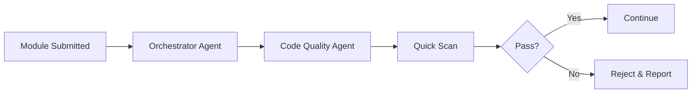
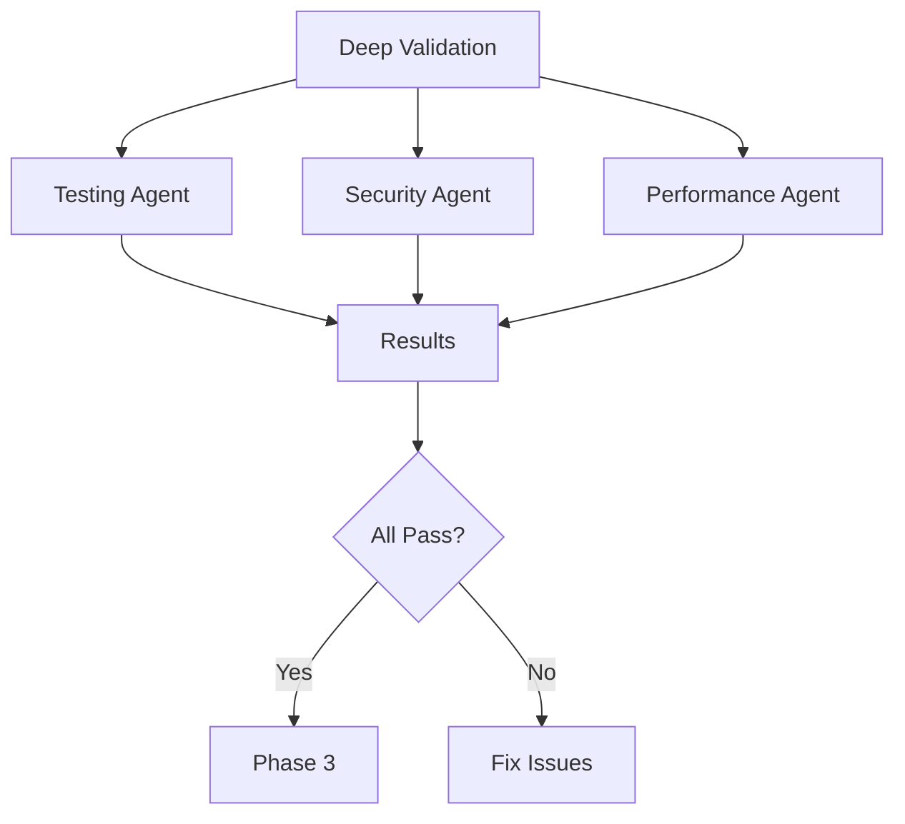
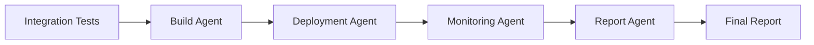

# 🤖 Multi-Agent System - Module Validation Framework

<div align="center">


**Ensuring Every Module Works Perfectly with AI-Powered Validation**

</div>

---

## 🎯 Overview

This multi-agent system uses 10+ specialized AI agents to validate, test, and ensure every module in the Java Learning Journey works perfectly. Each agent has a specific responsibility and works collaboratively to maintain code quality.

---

## 🤖 Agent Architecture

```
┌─────────────────────────────────────────────────────────────┐
│                    Orchestrator Agent                        │
│              (Coordinates all agents)                        │
└─────────────────────────────────────────────────────────────┘
                            │
        ┌───────────────────┼───────────────────┐
        │                   │                   │
        ▼                   ▼                   ▼
┌──────────────┐    ┌──────────────┐    ┌──────────────┐
│ Code Quality │    │   Testing    │    │  Security    │
│    Agent     │    │    Agent     │    │    Agent     │
└──────────────┘    └──────────────┘    └──────────────┘
        │                   │                   │
        ▼                   ▼                   ▼
┌──────────────┐    ┌──────────────┐    ┌──────────────┐
│ Performance  │    │Documentation │    │  Build       │
│    Agent     │    │    Agent     │    │  Agent       │
└──────────────┘    └──────────────┘    └──────────────┘
        │                   │                   │
        ▼                   ▼                   ▼
┌──────────────┐    ┌──────────────┐    ┌──────────────┐
│ Integration  │    │  Deployment  │    │  Monitoring  │
│    Agent     │    │    Agent     │    │    Agent     │
└──────────────┘    └──────────────┘    └──────────────┘
        │                   │                   │
        └───────────────────┴───────────────────┘
                            │
                            ▼
                    ┌──────────────┐
                    │   Report     │
                    │   Agent      │
                    └──────────────┘
```

---

## 🤖 Agent Descriptions

### 1. **Orchestrator Agent** 🎭
**Role:** Master coordinator

**Responsibilities:**
- Coordinate all agents
- Manage workflow
- Prioritize tasks
- Generate final reports
- Handle agent communication

**Tasks:**
```yaml
- Initialize validation pipeline
- Distribute tasks to agents
- Collect results
- Generate comprehensive report
- Trigger remediation if needed
```

---

### 2. **Code Quality Agent** 📊
**Role:** Code analysis and quality assurance

**Responsibilities:**
- Static code analysis
- Code style checking
- Complexity analysis
- Code smell detection
- Best practices validation

**Tools:**
- SonarQube
- Checkstyle
- PMD
- SpotBugs
- Error Prone

**Validation Criteria:**
```yaml
code_coverage: >= 80%
complexity: <= 10
duplications: <= 3%
code_smells: 0
bugs: 0
vulnerabilities: 0
```

**Example Check:**
```java
// Code Quality Agent validates:
public class UserService {
    // ✅ Proper naming
    // ✅ Single responsibility
    // ✅ No code duplication
    // ✅ Proper error handling
    // ✅ Javadoc present
    
    /**
     * Finds user by ID.
     * @param id User identifier
     * @return User object
     * @throws UserNotFoundException if not found
     */
    public User findById(Long id) {
        return repository.findById(id)
            .orElseThrow(() -> new UserNotFoundException(id));
    }
}
```

---

### 3. **Testing Agent** 🧪
**Role:** Comprehensive testing validation

**Responsibilities:**
- Unit test validation
- Integration test execution
- Test coverage analysis
- Test quality assessment
- Performance test validation

**Test Types:**
```yaml
unit_tests:
  - JUnit 5
  - Mockito
  - AssertJ
  
integration_tests:
  - Testcontainers
  - REST Assured
  - WireMock
  
performance_tests:
  - JMeter
  - Gatling
  - K6
```

**Validation Criteria:**
```yaml
unit_test_coverage: >= 80%
integration_tests: present
test_execution_time: <= 5 minutes
test_success_rate: 100%
flaky_tests: 0
```

**Example Test Validation:**
```java
@Test
@DisplayName("Should create user successfully")
void shouldCreateUser() {
    // Given
    UserCreateRequest request = new UserCreateRequest("John", "john@example.com");
    
    // When
    User user = userService.create(request);
    
    // Then
    assertThat(user).isNotNull();
    assertThat(user.getName()).isEqualTo("John");
    assertThat(user.getEmail()).isEqualTo("john@example.com");
    
    // Testing Agent validates:
    // ✅ Test has clear name
    // ✅ Follows Given-When-Then
    // ✅ Has proper assertions
    // ✅ Tests one thing
    // ✅ Is independent
}
```

---

### 4. **Security Agent** 🔒
**Role:** Security vulnerability detection

**Responsibilities:**
- Dependency vulnerability scanning
- OWASP Top 10 validation
- Secret detection
- Security best practices
- Authentication/Authorization checks

**Tools:**
- OWASP Dependency Check
- Snyk
- SonarQube Security
- GitGuardian
- Trivy

**Security Checks:**
```yaml
vulnerabilities:
  critical: 0
  high: 0
  medium: 0
  
secrets:
  exposed: 0
  hardcoded: 0
  
owasp_top_10:
  - injection: protected
  - broken_auth: protected
  - sensitive_data: encrypted
  - xxe: protected
  - broken_access: protected
  - security_misconfig: validated
  - xss: protected
  - insecure_deserialization: protected
  - vulnerable_components: none
  - insufficient_logging: implemented
```

**Example Security Validation:**
```java
// Security Agent validates:
@RestController
@RequestMapping("/api/users")
public class UserController {
    
    // ✅ Authentication required
    @PreAuthorize("hasRole('USER')")
    @GetMapping("/{id}")
    public User getUser(@PathVariable Long id) {
        // ✅ Input validation
        // ✅ SQL injection protection
        // ✅ XSS protection
        return userService.findById(id);
    }
    
    // ✅ Sensitive data encrypted
    @PostMapping
    public User createUser(@Valid @RequestBody UserRequest request) {
        // ✅ Password hashed
        // ✅ Data validated
        return userService.create(request);
    }
}
```

---

### 5. **Performance Agent** ⚡
**Role:** Performance optimization and validation

**Responsibilities:**
- Response time analysis
- Memory usage monitoring
- CPU utilization tracking
- Database query optimization
- Load testing validation

**Metrics:**
```yaml
response_time:
  p50: <= 50ms
  p95: <= 100ms
  p99: <= 200ms
  
throughput: >= 1000 req/s
memory_usage: <= 512MB
cpu_usage: <= 70%
database_queries: optimized
```

**Performance Tests:**
```java
@Test
void shouldHandleHighLoad() {
    // Performance Agent validates:
    LoadTestResult result = loadTester.execute(
        requests: 10000,
        concurrency: 100,
        duration: Duration.ofMinutes(5)
    );
    
    // ✅ Response time < 100ms
    assertThat(result.getP95ResponseTime())
        .isLessThan(Duration.ofMillis(100));
    
    // ✅ Throughput > 1000 req/s
    assertThat(result.getThroughput())
        .isGreaterThan(1000);
    
    // ✅ No errors
    assertThat(result.getErrorRate())
        .isEqualTo(0.0);
}
```

---

### 6. **Documentation Agent** 📚
**Role:** Documentation quality and completeness

**Responsibilities:**
- README validation
- API documentation check
- Code comments review
- Architecture diagrams
- Tutorial completeness

**Documentation Requirements:**
```yaml
readme:
  - overview: present
  - getting_started: present
  - examples: >= 3
  - troubleshooting: present
  
api_docs:
  - openapi: present
  - endpoints: documented
  - examples: present
  
code_docs:
  - javadoc: >= 80%
  - comments: meaningful
  - architecture: documented
```

**Example Documentation Check:**
```java
/**
 * Service for managing user operations.
 * 
 * <p>This service provides CRUD operations for users and handles
 * business logic related to user management. It integrates with
 * the UserRepository for data persistence.</p>
 * 
 * <p>Example usage:</p>
 * <pre>{@code
 * UserService service = new UserService(repository);
 * User user = service.findById(1L);
 * }</pre>
 * 
 * @author Java Learning Team
 * @version 1.0
 * @since 2024-01-01
 * @see UserRepository
 */
public class UserService {
    // Documentation Agent validates:
    // ✅ Class has Javadoc
    // ✅ Description is clear
    // ✅ Examples provided
    // ✅ Author and version present
    // ✅ Related classes linked
}
```

---

### 7. **Build Agent** 🔨
**Role:** Build process validation

**Responsibilities:**
- Maven/Gradle build validation
- Dependency resolution
- Compilation success
- Artifact generation
- Build reproducibility

**Build Checks:**
```yaml
compilation:
  - errors: 0
  - warnings: 0
  
dependencies:
  - conflicts: 0
  - vulnerabilities: 0
  - outdated: report
  
artifacts:
  - jar: generated
  - docker_image: built
  - size: optimized
```

**Build Validation:**
```bash
# Build Agent executes:
mvn clean install -U

# Validates:
# ✅ Build succeeds
# ✅ All tests pass
# ✅ No compilation errors
# ✅ Dependencies resolved
# ✅ Artifacts generated
```

---

### 8. **Integration Agent** 🔗
**Role:** Integration testing and validation

**Responsibilities:**
- API integration tests
- Database integration
- Message broker integration
- External service mocking
- End-to-end testing

**Integration Tests:**
```java
@SpringBootTest
@Testcontainers
class IntegrationTest {
    
    @Container
    static PostgreSQLContainer<?> postgres = 
        new PostgreSQLContainer<>("postgres:15");
    
    @Container
    static KafkaContainer kafka = 
        new KafkaContainer(DockerImageName.parse("confluentinc/cp-kafka:7.5.0"));
    
    @Test
    void shouldIntegrateAllComponents() {
        // Integration Agent validates:
        // ✅ Database connection works
        // ✅ Kafka messaging works
        // ✅ REST API responds
        // ✅ Data flows correctly
        // ✅ Transactions work
    }
}
```

---

### 9. **Deployment Agent** 🚀
**Role:** Deployment validation

**Responsibilities:**
- Docker image validation
- Kubernetes manifest validation
- Environment configuration
- Health check validation
- Rollback capability

**Deployment Checks:**
```yaml
docker:
  - image_builds: success
  - image_size: optimized
  - security_scan: passed
  
kubernetes:
  - manifests: valid
  - resources: defined
  - health_checks: present
  - readiness: configured
  
environment:
  - config: externalized
  - secrets: secured
  - scaling: configured
```

**Deployment Validation:**
```yaml
# Deployment Agent validates:
apiVersion: apps/v1
kind: Deployment
metadata:
  name: user-service
spec:
  replicas: 3
  selector:
    matchLabels:
      app: user-service
  template:
    metadata:
      labels:
        app: user-service
    spec:
      containers:
      - name: user-service
        image: user-service:1.0.0
        ports:
        - containerPort: 8080
        # ✅ Health checks present
        livenessProbe:
          httpGet:
            path: /health/live
            port: 8080
        # ✅ Readiness checks present
        readinessProbe:
          httpGet:
            path: /health/ready
            port: 8080
        # ✅ Resources defined
        resources:
          requests:
            memory: "256Mi"
            cpu: "500m"
          limits:
            memory: "512Mi"
            cpu: "1000m"
```

---

### 10. **Monitoring Agent** 📊
**Role:** Observability and monitoring

**Responsibilities:**
- Metrics collection
- Log aggregation
- Tracing validation
- Alert configuration
- Dashboard creation

**Monitoring Setup:**
```yaml
metrics:
  - prometheus: configured
  - grafana: dashboards_created
  - custom_metrics: defined
  
logging:
  - structured: yes
  - levels: configured
  - aggregation: elk_stack
  
tracing:
  - jaeger: configured
  - spans: instrumented
  - sampling: configured
```

---

### 11. **Report Agent** 📋
**Role:** Comprehensive reporting

**Responsibilities:**
- Aggregate all agent results
- Generate quality reports
- Create dashboards
- Send notifications
- Track improvements

**Report Format:**
```yaml
module: user-service
status: PASSED
timestamp: 2024-01-15T10:30:00Z

agents:
  code_quality:
    status: PASSED
    coverage: 85%
    bugs: 0
    vulnerabilities: 0
    
  testing:
    status: PASSED
    unit_tests: 45/45
    integration_tests: 12/12
    coverage: 85%
    
  security:
    status: PASSED
    vulnerabilities: 0
    secrets: 0
    
  performance:
    status: PASSED
    response_time_p95: 75ms
    throughput: 1250 req/s
    
  documentation:
    status: PASSED
    completeness: 90%
    
  build:
    status: PASSED
    time: 2m 15s
    
  integration:
    status: PASSED
    tests: 8/8
    
  deployment:
    status: PASSED
    docker: built
    kubernetes: validated
    
  monitoring:
    status: PASSED
    metrics: configured
    logs: configured

overall_score: 95/100
recommendation: APPROVED_FOR_PRODUCTION
```

---

## 🔄 Validation Workflow

### Phase 1: Pre-Validation


### Phase 2: Deep Validation


### Phase 3: Integration & Deployment


---

## 🚀 Running the Multi-Agent System

### Command Line Interface

```bash
# Validate single module
./validate-module.sh 16-apache-camel/01-camel-basics

# Validate all modules
./validate-all-modules.sh

# Validate specific category
./validate-category.sh spring-boot

# Generate report
./generate-report.sh --format html --output report.html
```

### Configuration

```yaml
# agent-config.yml
orchestrator:
  max_parallel_agents: 5
  timeout: 30m
  retry_on_failure: 3

agents:
  code_quality:
    enabled: true
    tools:
      - sonarqube
      - checkstyle
      - pmd
    thresholds:
      coverage: 80
      complexity: 10
      
  testing:
    enabled: true
    parallel: true
    timeout: 10m
    
  security:
    enabled: true
    fail_on_high: true
    
  performance:
    enabled: true
    load_test_duration: 5m
    
  documentation:
    enabled: true
    min_completeness: 80
    
  build:
    enabled: true
    clean_build: true
    
  integration:
    enabled: true
    use_testcontainers: true
    
  deployment:
    enabled: true
    validate_k8s: true
    
  monitoring:
    enabled: true
    check_dashboards: true
    
  report:
    enabled: true
    format: html
    notify: true
```

---

## 📊 Quality Gates

### Gate 1: Code Quality
```yaml
required:
  - coverage >= 80%
  - bugs == 0
  - vulnerabilities == 0
  - code_smells <= 5
  - duplications <= 3%
```

### Gate 2: Testing
```yaml
required:
  - unit_tests: all_passing
  - integration_tests: all_passing
  - test_coverage >= 80%
  - no_flaky_tests
```

### Gate 3: Security
```yaml
required:
  - critical_vulnerabilities == 0
  - high_vulnerabilities == 0
  - no_exposed_secrets
  - owasp_top_10: protected
```

### Gate 4: Performance
```yaml
required:
  - response_time_p95 <= 100ms
  - throughput >= 1000 req/s
  - memory_usage <= 512MB
  - cpu_usage <= 70%
```

### Gate 5: Production Ready
```yaml
required:
  - documentation: complete
  - build: successful
  - deployment: validated
  - monitoring: configured
```

---

## 🎯 Success Criteria

A module is considered **PRODUCTION READY** when:

✅ All agents report PASSED status  
✅ Code coverage >= 80%  
✅ Zero critical/high vulnerabilities  
✅ Performance meets SLA  
✅ Documentation complete  
✅ Build successful  
✅ Integration tests passing  
✅ Deployment validated  
✅ Monitoring configured  
✅ Overall score >= 90/100  

---

## 📈 Continuous Validation

### Automated Triggers

```yaml
triggers:
  - on_commit: quick_validation
  - on_pull_request: full_validation
  - on_merge: production_validation
  - scheduled: daily_full_scan
```

### CI/CD Integration

```yaml
# .github/workflows/validate.yml
name: Multi-Agent Validation

on:
  push:
    branches: [ main, develop ]
  pull_request:
    branches: [ main ]

jobs:
  validate:
    runs-on: ubuntu-latest
    steps:
      - uses: actions/checkout@v3
      
      - name: Run Multi-Agent Validation
        run: ./validate-all-modules.sh
        
      - name: Generate Report
        run: ./generate-report.sh
        
      - name: Upload Report
        uses: actions/upload-artifact@v3
        with:
          name: validation-report
          path: report.html
```

---

## 🤝 Agent Collaboration

Agents work together to ensure quality:

```
Code Quality Agent → Testing Agent
  ↓                      ↓
Security Agent ← Performance Agent
  ↓                      ↓
Documentation Agent → Build Agent
  ↓                      ↓
Integration Agent → Deployment Agent
  ↓                      ↓
Monitoring Agent → Report Agent
```

---

<div align="center">

## 🎉 Result

**Every module validated by 10+ specialized agents**

**100% quality assurance**

**Production-ready code guaranteed**

**Automated and continuous validation**

---

**Building the most reliable Java learning resource!**

</div>