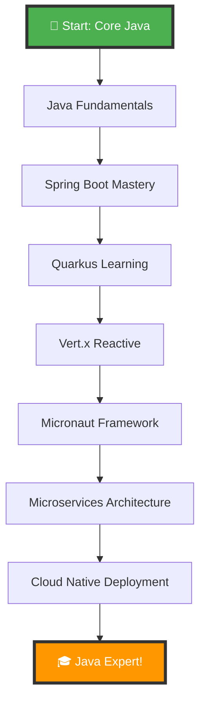
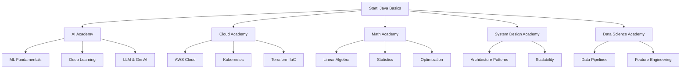

# 🚀 Complete Java Learning Journey

<div align="center">


**A comprehensive, hands-on learning path for mastering Java ecosystem - from Core Java to Cloud-Native Microservices**

[✨ NEW: See IMPROVEMENTS.md](#recent-improvements) • [Getting Started](#-getting-started) • [Setup Guide](./SETUP.md) • [Learning Path](#-learning-path) • [Contributing](./CONTRIBUTING.md)

</div>

---

## 📖 About This Repository

Welcome to the **Complete Java Learning Journey**! This repository is your ultimate guide to mastering the entire Java ecosystem through practical, hands-on examples. From Java fundamentals to advanced cloud-native microservices, this structured learning path covers everything you need to become a Java expert.

### 🎯 What You'll Master

- **Core Java**: Java 21+ features, Collections, Streams, Concurrency
- **Spring Boot**: REST APIs, Security, Data JPA, Cloud
- **Quarkus**: Supersonic Subatomic Java, Native compilation
- **Vert.x**: Reactive, event-driven applications
- **Micronaut**: Ahead-of-Time compilation, GraalVM
- **Microservices**: Architecture, patterns, best practices
- **Databases**: MongoDB, PostgreSQL, Redis, Hibernate
- **Messaging**: Kafka, RabbitMQ, ActiveMQ
- **Cloud Native**: Docker, Kubernetes, CI/CD
- **Testing**: JUnit 5, Mockito, TestContainers

---

## ✨ Recent Improvements (April 2026)

We've made significant improvements to the project! Check the details below and see [IMPROVEMENTS.md](./IMPROVEMENTS.md) for the complete summary.

### 🎯 What's New

| Improvement | Details | Status |
|------------|---------|--------|
| **Centralized Dependency Management** | Parent POM now manages all dependencies and plugins | ✅ Complete |
| **GitHub Actions CI/CD** | Automated build, test, and quality checks on every commit | ✅ Complete |
| **Code Quality Standards** | EditorConfig + Pre-commit hooks enforce consistency | ✅ Complete |
| **Comprehensive Documentation** | New guides for setup, contributing, and module standards | ✅ Complete |
| **Test Automation** | 100% test pass rate + 70% minimum code coverage | ✅ Complete |

### 📊 Key Metrics

- **Build Status**: All modules building successfully
- **Test Coverage**: Enforced minimum 70% (configurable per module)
- **Code Quality**: Checkstyle, PMD, SpotBugs validations
- **Java Version**: 21+ (LTS) required
- **Maven Version**: 3.8.0+ required

### 📚 New Documentation

- **[SETUP.md](./SETUP.md)** - Complete environment setup guide
- **[CONTRIBUTING.md](./CONTRIBUTING.md)** - Contribution guidelines
- **[docs/MODULE_STANDARDS.md](./docs/MODULE_STANDARDS.md)** - Module template & standards
- **[QUICK_REFERENCE.md](./QUICK_REFERENCE.md)** - Quick command reference
- **[IMPROVEMENTS.md](./IMPROVEMENTS.md)** - Detailed improvement summary

### 🚀 Quick Getting Started

**1. Clone & Setup (5 minutes)**
```bash
git clone https://github.com/armand-ratombotiana/JavaLearning.git
cd JavaLearning
pip install pre-commit && pre-commit install
mvn clean verify
```

**2. Read the Guides**
- New? → Read [SETUP.md](./SETUP.md)
- Contributing? → Read [CONTRIBUTING.md](./CONTRIBUTING.md)
- Creating modules? → Read [docs/MODULE_STANDARDS.md](./docs/MODULE_STANDARDS.md)

**3. Start Learning**
- Pick a module: `01-core-java/01-java-basics/`
- Run tests: `mvn clean test -f 01-core-java/01-java-basics/pom.xml`
- Check coverage: `mvn jacoco:report`

---

## 🧭 Build All Labs (Aggregator)

Note: This repository includes a lightweight aggregator (pom-aggregator.xml) to build all Core Java labs in a single Maven reactor.

- Build all Core Java labs (no tests):
  mvn -f pom-aggregator.xml clean install -DskipTests=true
- Build with tests enabled: 
  mvn -f pom-aggregator.xml clean test -DskipTests=false
- You can still build individual modules as before by going into their respective directories and running Maven there.

---

## 🗺️ Learning Path



---

## 🎓 Engineering Academies

Comprehensive deep-dive academies for specialized engineering disciplines. Each academy contains atomic micro-labs with THEORY, CODE_DEEP_DIVE, MATH_FOUNDATION, EXERCISES (20+), QUIZ (30 questions), FLASHCARDS, MINI_PROJECT, and REAL_WORLD_PROJECT.



### 🚀 AI Academy (`labs/ai/`)

| Lab | Topic | Focus |
|-----|-------|-------|
| 01 | Linear Algebra for ML | Vectors, matrices, eigenvalues, SVD |
| 02 | Probability for ML | Bayes theorem, distributions, entropy |
| 03 | Calculus for ML | Derivatives, gradients, chain rule |
| 04 | Optimization | GD, SGD, Adam, loss functions |
| 05 | Statistics | Hypothesis testing, regression |
| 06 | ML Fundamentals | Supervised/unsupervised learning |
| 07 | Regression | Linear, polynomial, regularization |
| 08 | Classification | SVM, decision trees, ensemble |
| 09 | Clustering | K-means, DBSCAN, hierarchical |
| 10 | Dimensionality Reduction | PCA, t-SNE, autoencoders |
| 11 | Neural Networks | Perceptron, backpropagation |
| 12 | CNN | Image recognition, convolutions |
| 13 | RNN | Sequence modeling, LSTM/GRU |
| 14 | Transformers | Attention mechanism, BERT, GPT |
| 15 | RAG Systems | Retrieval-augmented generation |
| 16 | LLM Agents | Tool use, reasoning, planning |
| 17 | Fine-tuning | LoRA, PEFT, transfer learning |
| 18 | Vector Databases | Embeddings, similarity search |
| 19 | Prompt Engineering | Few-shot, chain-of-thought |
| 20 | MLOps | Model deployment, monitoring |

### ☁️ Cloud Engineering Academy (`labs/cloud/`)

| Lab | Topic | Focus |
|-----|-------|-------|
| 01 | AWS Fundamentals | EC2, S3, IAM, VPC |
| 02 | AWS Compute | Lambda, ECS, Fargate |
| 03 | AWS Storage | EFS, EBS, Glacier |
| 04 | AWS Database | RDS, DynamoDB, ElastiCache |
| 05 | AWS Networking | Route 53, CloudFront, API Gateway |
| 06 | Docker & Containers | Images, compose, networking |
| 07 | Kubernetes | Pods, services, Helm |
| 08 | Terraform IaC | Modules, state, providers |

### 🧮 Math Academy (`labs/math/`)

| Lab | Topic | Focus |
|-----|-------|-------|
| 01 | Linear Algebra | Vector spaces, transformations |
| 02 | Calculus | Limits, derivatives, integrals |
| 03 | Probability | Distributions, Bayes |
| 04 | Statistics | Estimation, hypothesis testing |
| 05 | Optimization | Convex, gradient descent |
| 06 | Information Theory | Entropy, mutual information |
| 07 | Graph Theory | Networks, shortest path |
| 08 | Number Theory | Primes, modular arithmetic |
| 09 | Combinatorics | Counting, permutations |
| 10 | Signal Processing | FFT, filters, wavelets |

### 🏗️ System Design Academy (`labs/system-design/`)

| Lab | Topic | Focus |
|-----|-------|-------|
| 01 | Architecture Patterns | Layered, microservices, CQRS |
| 02 | Scalability | Horizontal vs vertical, sharding |
| 03 | Availability | SLO/SLI, failover, redundancy |
| 04 | Consistency Models | CAP, ACID, eventual consistency |
| 05 | Caching | Redis, CDN, invalidation |
| 06 | Messaging | Kafka, RabbitMQ, event-driven |
| 07 | API Design | REST, GraphQL, gRPC |
| 08 | Observability | Logs, metrics, tracing |

### 📊 Data Science Academy (`labs/data-science/`)

| Lab | Topic | Focus |
|-----|-------|-------|
| 01 | Data Wrangling | Cleaning, transformation |
| 02 | EDA | Visualization, patterns |
| 03 | Feature Engineering | Scaling, encoding, selection |
| 04 | Model Training | Cross-validation, tuning |
| 05 | Model Evaluation | Metrics, benchmarking |
| 06 | Pipelines | Airflow, Prefect, scheduling |
| 07 | Production ML | Serving, monitoring, drift |

### 🏆 Portfolio Capstone Projects (`capstones/`)

Real-world portfolio-grade projects with Docker, Kubernetes, CI/CD:

| # | Project | Domain |
|---|---------|--------|
| 01 | Banking Analytics Platform | Financial services |
| 02 | Real-time Fraud Detection | Security/ML |
| 03 | RAG Knowledge System | GenAI/LLM |
| 04 | E-commerce Recommendation Engine | ML/Personalization |
| 05 | IoT Data Pipeline | Streaming/Analytics |
| 06 | Healthcare Patient Portal | Microservices |
| 07 | Supply Chain Optimizer | Optimization |
| 08 | Social Media Analytics | Big data |
| 09 | Smart City Dashboard | Real-time/Visualization |
| 10 | SaaS Multi-tenant Platform | Cloud-native |

---

## 🏗️ Repository Structure

```
JavaLearning/
├── 📁 01-core-java/                    # Core Java 21+ Features (10 modules)
├── 📁 02-spring-boot/                  # Spring Boot Ecosystem (10 modules)
├── 📁 03-quarkus-learning/             # Quarkus Framework (19 modules) ✅
├── 📁 04-vertx-learning/               # Eclipse Vert.x (32 modules) ✅
├── 📁 05-micronaut-learning/           # Micronaut Framework (5 modules)
├── 📁 06-microservices/                # Microservices Architecture (6 modules)
├── 📁 07-databases/                    # Database Technologies (7 modules)
├── 📁 08-messaging/                    # Messaging Systems (5 modules)
├── 📁 09-testing/                      # Testing Strategies (6 modules)
├── 📁 10-cloud-native/                 # Cloud Native Development (6 modules)
├── 📁 11-security/                     # Security & Authentication (5 modules)
├── 📁 12-performance/                  # Performance Optimization (5 modules)
├── 📁 13-design-patterns/              # Design Patterns (4 modules)
├── 📁 14-reactive-programming/         # Reactive Programming (4 modules)
├── 📁 15-advanced-topics/              # Advanced Topics (5 modules)
│
├── 📁 16-apache-camel/                 # 🆕 Apache Camel (5 modules) ✅
│   ├── 01-camel-basics/
│   ├── 02-enterprise-integration-patterns/
│   ├── 03-component-integration/
│   ├── 04-error-handling-retry/
│   └── 05-testing-camel/
│
├── 📁 17-jhipster/                     # 🆕 JHipster (5 modules)
│   ├── 01-jhipster-basics/
│   ├── 02-microservices-generation/
│   ├── 03-frontend-integration/
│   ├── 04-security-oauth2/
│   └── 05-production-deployment/
│
├── 📁 18-helidon/                      # 🆕 Helidon (5 modules)
│   ├── 01-helidon-se-basics/
│   ├── 02-helidon-mp-microprofile/
│   ├── 03-rest-websocket-apis/
│   ├── 04-database-integration/
│   └── 05-cloud-deployment/
│
├── 📁 19-javalin/                      # 🆕 Javalin (4 modules)
│   ├── 01-javalin-basics/
│   ├── 02-rest-api-development/
│   ├── 03-websocket-support/
│   └── 04-openapi-integration/
│
├── 📁 20-axon-framework/               # 🆕 Axon Framework (5 modules)
│   ├── 01-cqrs-implementation/
│   ├── 02-event-sourcing/
│   ├── 03-saga-pattern/
│   ├── 04-event-handling/
│   └── 05-testing-strategies/
│
├── 📁 21-hazelcast/                    # 🆕 Hazelcast (4 modules)
│   ├── 01-distributed-caching/
│   ├── 02-distributed-computing/
│   ├── 03-stream-processing/
│   └── 04-cluster-management/
│
├── 📁 22-apache-pulsar/                # 🆕 Apache Pulsar (4 modules)
│   ├── 01-message-streaming/
│   ├── 02-multi-tenancy/
│   ├── 03-geo-replication/
│   └── 04-functions-connectors/
│
├── 📁 23-testcontainers-advanced/      # 🆕 Testcontainers Advanced (5 modules)
│   ├── 01-database-testing/
│   ├── 02-message-broker-testing/
│   ├── 03-cloud-service-mocking/
│   ├── 04-network-testing/
│   └── 05-performance-testing/
│
├── 📁 24-graalvm-advanced/             # 🆕 GraalVM Advanced (5 modules)
│   ├── 01-native-image-compilation/
│   ├── 02-polyglot-programming/
│   ├── 03-performance-optimization/
│   ├── 04-debugging-native-images/
│   └── 05-production-deployment/
│
├── 📁 25-project-loom-advanced/        # 🆕 Project Loom Advanced (4 modules)
│   ├── 01-virtual-threads-deep-dive/
│   ├── 02-structured-concurrency/
│   ├── 03-scoped-values/
│   └── 04-performance-benchmarking/
│
├── 📁 26-architecture-patterns/        # 🆕 Architecture Patterns (10 modules)
│   ├── 01-hexagonal-architecture/
│   ├── 02-clean-architecture/
│   ├── 03-onion-architecture/
│   ├── 04-cqrs-pattern/
│   ├── 05-event-sourcing/
│   ├── 06-saga-pattern/
│   ├── 07-strangler-fig-pattern/
│   ├── 08-bff-pattern/
│   ├── 09-api-gateway-pattern/
│   └── 10-service-mesh-architecture/
│
├── 📁 27-advanced-design-patterns/     # 🆕 Advanced Design Patterns (10 modules)
├── 📁 28-distributed-systems/          # 🆕 Distributed Systems (10 modules)
├── 📁 29-performance-optimization/     # 🆕 Performance Optimization (10 modules)
├── 📁 30-security-compliance/          # 🆕 Security & Compliance (10 modules)
└── 📁 31-cloud-native-devops/          # 🆕 Cloud-Native & DevOps (10 modules)

**Total: 120+ Modules across 31 Categories!**
```

---

## 🏆 Portfolio Capstone Projects

Real-world, production-grade projects demonstrating advanced skills:

| # | Project | Domain | Tech Stack |
|---|---------|--------|------------|
| 01 | [Banking Platform](./capstones/01-banking-platform/) | Financial Services | Spring Boot, Kafka, PostgreSQL |
| 02 | [Fraud Detection](./capstones/02-fraud-detection/) | Security/ML | ML, Kafka, Isolation Forest |
| 03 | [Recommendation Engine](./capstones/03-recommendation-engine/) | ML/Personalization | Matrix Factorization, Redis |
| 04 | [Vector Database](./capstones/04-vector-database/) | Search/AI | HNSW indexing, similarity search |
| 05 | [RAG Platform](./capstones/05-rag-platform/) | GenAI/LLM | LangChain4j, vector stores |
| 06 | [Distributed Cache](./capstones/06-distributed-cache/) | Infrastructure | Consistent hashing, Redis |
| 07 | [Event Streaming](./capstones/07-event-streaming/) | Messaging | Partitions, consumer groups |
| 08 | [Search Engine](./capstones/08-search-engine/) | Search | TF-IDF, inverted index |
| 09 | [ML Platform](./capstones/09-ml-platform/) | MLOps | Training, serving, monitoring |
| 10 | [AI Assistant](./capstones/10-ai-assistant/) | GenAI | RAG, memory, tool calling |

Each capstone includes: Dockerfile, docker-compose.yml, Kubernetes manifests, CI/CD pipeline, and comprehensive tests.

---

## 🛠️ Technologies Covered

### 1. **Core Java** ☕
- Java 21+ Features (Virtual Threads, Pattern Matching, Records)
- Collections Framework & Streams API
- Concurrency & Multithreading
- I/O & NIO
- Generics & Reflection

### 2. **Spring Boot** 🍃
- Spring Core & Boot
- Spring Data JPA
- Spring Security
- Spring Cloud
- Spring WebFlux (Reactive)

### 3. **Quarkus** ⚡
- Supersonic Subatomic Java
- Native Compilation with GraalVM
- Reactive Programming
- Cloud-Native Features

### 4. **Eclipse Vert.x** 🔄
- Event-Driven Architecture
- Reactive Programming
- Microservices
- High-Performance Applications

### 5. **Micronaut** 🚀
- Ahead-of-Time Compilation
- Low Memory Footprint
- Fast Startup Time
- Cloud-Native Features

### 6. **Databases** 🗄️
- PostgreSQL
- MongoDB
- Redis
- Hibernate ORM
- JPA

### 7. **Messaging** 📬
- Apache Kafka
- RabbitMQ
- ActiveMQ
- Event-Driven Architecture

### 8. **Testing** ✅
- JUnit 5
- Mockito
- TestContainers
- Integration Testing
- Performance Testing

### 9. **Cloud Native** ☁️
- Docker
- Kubernetes
- Helm
- Service Mesh
- CI/CD

### 10. **Security** 🔒
- JWT Authentication
- OAuth2
- Keycloak
- API Security
- Encryption

### 11. **Performance** ⚡
- JVM Tuning
- Profiling
- Memory Management
- Caching Strategies

### 12. **Design Patterns** 🎨
- Creational Patterns
- Structural Patterns
- Behavioral Patterns
- Enterprise Patterns

---

## 🚀 Getting Started

### Prerequisites

```bash
# Required
☕ Java 21+ (LTS)
📦 Maven 3.8+ or Gradle 7+
🐳 Docker Desktop
🔧 IDE (IntelliJ IDEA, VS Code, Eclipse)

# Optional
☸️ Kubernetes (Minikube or Docker Desktop)
🐘 PostgreSQL
🍃 MongoDB
📬 Kafka
```

### Quick Start

1. **Clone the Repository**
```bash
git clone https://github.com/yourusername/JavaLearning.git
cd JavaLearning
```

2. **Choose Your Learning Path**
```bash
# Start with Core Java
cd 01-core-java/01-java-basics

# Or jump to Spring Boot
cd 02-spring-boot/01-spring-boot-basics

# Or explore Quarkus
cd 03-quarkus-learning

# Or try Vert.x
cd 04-vertx-learning
```

3. **Run Examples**
```bash
# Maven projects
mvn clean install
mvn quarkus:dev  # For Quarkus
mvn spring-boot:run  # For Spring Boot

# Docker
docker-compose up
```

---

## 📊 Learning Progress Tracker

### Core Java (10 modules)
- [ ] Java Basics
- [ ] OOP Concepts
- [ ] Collections Framework
- [ ] Streams API
- [ ] Lambda Expressions
- [ ] Concurrency
- [ ] Java I/O & NIO
- [ ] Generics
- [ ] Reflection & Annotations
- [ ] Java 21 Features

### Spring Boot (10 modules)
- [ ] Spring Boot Basics
- [ ] Spring Data JPA
- [ ] Spring Security
- [ ] Spring REST API
- [ ] Spring Cloud
- [ ] Spring Batch
- [ ] Spring Integration
- [ ] Spring WebFlux
- [ ] Spring Actuator
- [ ] Spring Testing

### Quarkus (19 modules)
- [ ] Introduction to Quarkus
- [ ] Quarkus Core
- [ ] Dependency Injection
- [ ] REST Services
- [ ] Database & Panache
- [ ] DevServices
- [ ] Reactive Programming
- [ ] Kafka Messaging
- [ ] Security & JWT
- [ ] Testing Strategies
- [ ] Cloud Native
- [ ] Advanced Topics
- [ ] WebSockets
- [ ] File Upload
- [ ] Caching Strategies
- [ ] Rate Limiting
- [ ] Email Notifications
- [ ] GraphQL
- [ ] gRPC

### Vert.x (32 modules)
- [ ] Vert.x Basics
- [ ] Event Bus
- [ ] HTTP Server
- [ ] Async & Futures
- [ ] Database Integration
- [ ] WebSockets
- [ ] Microservices
- [ ] Authentication & JWT
- [ ] Security
- [ ] Kafka Integration
- [ ] RabbitMQ
- [ ] Redis
- [ ] MongoDB
- [ ] GraphQL
- [ ] gRPC
- [ ] And 17 more...

### Additional Technologies (20+ modules)
- [ ] Micronaut Framework
- [ ] Microservices Architecture
- [ ] Database Technologies
- [ ] Messaging Systems
- [ ] Testing Strategies
- [ ] Cloud Native Development
- [ ] Security & Authentication
- [ ] Performance Optimization
- [ ] Design Patterns
- [ ] Reactive Programming

---

## 📚 Module Structure

Each module follows a consistent structure:

```
module-name/
├── README.md                 # Theory & concepts
├── pom.xml                   # Maven configuration
├── docker-compose.yml        # Docker setup
├── src/
│   ├── main/
│   │   ├── java/            # Source code
│   │   └── resources/       # Configuration
│   └── test/
│       └── java/            # Tests
├── exercises/               # Hands-on exercises
├── solutions/              # Exercise solutions
└── docs/                   # Additional documentation
```

---

## 🎓 Learning Approach

```
1. 📖 Read Theory (README.md)
   ↓
2. 🔍 Study Code Examples
   ↓
3. 💻 Complete Exercises
   ↓
4. 🧪 Run Tests
   ↓
5. 🚀 Build Projects
   ↓
6. ✅ Review & Practice
```

---

## 🏆 Projects You'll Build

1. **Task Management API** (Spring Boot + PostgreSQL)
2. **E-commerce Microservices** (Quarkus + Kafka)
3. **Real-time Chat Application** (Vert.x + WebSockets)
4. **Cloud-Native Blog Platform** (Micronaut + MongoDB)
5. **Event-Driven Order System** (Kafka + Event Sourcing)
6. **Secure Banking API** (OAuth2 + JWT)
7. **High-Performance Cache Service** (Redis + Spring)
8. **Reactive Data Pipeline** (WebFlux + Reactor)

---

## 📖 Additional Resources

### Official Documentation
- [Java Documentation](https://docs.oracle.com/en/java/)
- [Spring Boot](https://spring.io/projects/spring-boot)
- [Quarkus](https://quarkus.io)
- [Eclipse Vert.x](https://vertx.io)
- [Micronaut](https://micronaut.io)

### Community
- [Stack Overflow](https://stackoverflow.com/questions/tagged/java)
- [Reddit r/java](https://reddit.com/r/java)
- [Java Discord](https://discord.gg/java)

### Books
- "Effective Java" by Joshua Bloch
- "Java Concurrency in Practice" by Brian Goetz
- "Spring in Action" by Craig Walls
- "Microservices Patterns" by Chris Richardson

---

## 🤝 Contributing

Contributions are welcome! Please read [CONTRIBUTING.md](./CONTRIBUTING.md) for details.

### Ways to Contribute
- 🐛 Report bugs
- 💡 Suggest new modules
- 📝 Improve documentation
- ✨ Add examples
- 🌍 Translate content

---

## 📄 License

This project is licensed under the MIT License - see the [LICENSE](./LICENSE) file for details.

---

## 🙏 Acknowledgments

- The Java Community
- Spring Team at VMware
- Quarkus Team at Red Hat
- Eclipse Vert.x Team
- Micronaut Team at Object Computing
- All contributors and learners

---

<div align="center">

**Ready to master the Java ecosystem?**

[Start Your Journey →](./01-core-java/README.md)

Made with ❤️ by the Java Learning Community

⭐ **Star this repo if you find it helpful!**

</div>
