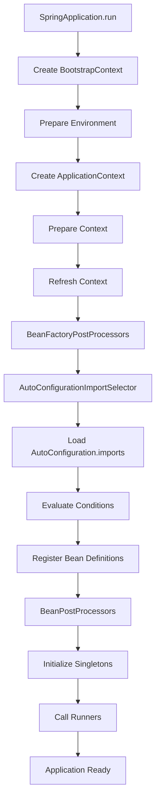
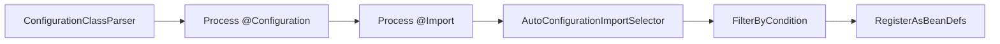

# Architecture Overview Diagram

```mermaid
graph TD
    A[SpringApplication.run] --> B[Create BootstrapContext]
    B --> C[Prepare Environment]
    C --> D[Create ApplicationContext]
    D --> E[Prepare Context]
    E --> F[Refresh Context]
    F --> G[BeanFactoryPostProcessors]
    G --> H[AutoConfigurationImportSelector]
    H --> I[Load AutoConfiguration.imports]
    I --> J[Evaluate Conditions]
    J --> K[Register Bean Definitions]
    K --> L[BeanPostProcessors]
    L --> M[Initialize Singletons]
    M --> N[Call Runners]
    N --> O[Application Ready]
```

```mermaid
graph LR
    P[ConfigurationClassParser] --> Q[Process @Configuration]
    Q --> R[Process @Import]
    R --> S[AutoConfigurationImportSelector]
    S --> T[FilterByCondition]
    T --> U[RegisterAsBeanDefs]
```