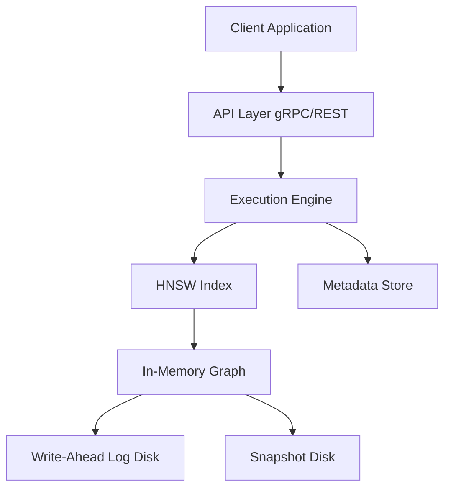

# Vector Database Architecture

## 🏛️ System Design Overview
A Vector Database is fundamentally different from a relational database (PostgreSQL) or a document store (MongoDB). Instead of querying for exact matches, it queries for **similarity** in a high-dimensional continuous space.

To build a production-grade vector database, we must architect several distinct subsystems.

### 1. The Storage Engine
Vectors (arrays of floats) are memory-intensive. A 1536-dimensional vector (standard OpenAI embedding) requires ~6KB of memory. One million vectors require ~6GB.
- **In-Memory Store**: The active index must reside in RAM for sub-millisecond query latency.
- **Write-Ahead Log (WAL)**: To guarantee durability (ACID properties), all inserts/deletes are appended to a WAL on disk before being applied to the in-memory index.
- **Snapshotting**: The in-memory index is periodically serialized to disk to allow fast recovery on restart without replaying the entire WAL.

### 2. The Indexing Engine (HNSW)
A brute-force search (comparing the query vector against every single stored vector) is $O(N)$. For millions of vectors, this is too slow.
We must use an **Approximate Nearest Neighbor (ANN)** algorithm. We will implement **HNSW (Hierarchical Navigable Small World)**, the industry standard used by Pinecone, Milvus, and Qdrant.

### 3. The Execution Engine
Handles incoming queries, computes distances, and filters results.
- **Distance Metrics**: Pluggable strategies for Cosine Similarity, L2 (Euclidean) Distance, and Inner Product.
- **SIMD Optimization**: Vector math must be heavily optimized. In Java, this means leveraging the Vector API (JEP 460) to perform calculations using CPU SIMD instructions.

### 4. The API Layer
- **gRPC**: Preferred for high-throughput, low-latency binary communication.
- **REST**: Provided for ease of integration with web clients.

## 📊 Component Diagram

