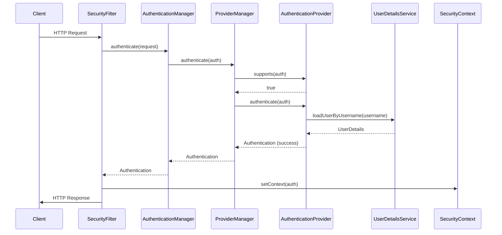

# Visual Guide to 05-keycloak

## Mermaid Sequence Diagram



## Request Flow Diagram

```
Client -> FilterChain -> AuthenticationManager -> ProviderManager -> UserDetailsService
   |           |                |                      |
   +-----------+----------------+----------------------+

1. HTTP Request arrives
2. Security filters intercept
3. Authentication extracted
4. Credentials validated
5. Security context established
6. Authorization check
7. Resource served or denied
```

## Security Architecture Diagram

```
+------------------------------------------------+
|              Spring Security Filter Chain        |
|  +------+ +------+ +------+ +------+ +-------+ |
|  |CORS  | |CSRF  | |Auth  | |Async | |Filter | |
|  |Filter| |Filter| |Filter| |Mgt   | |Security| |
|  +------+ +------+ +------+ +------+ +-------+ |
+------------------------------------------------+
                        |
+------------------------------------------------+
|           Application Controllers                |
|  @RequestMapping annotated methods               |
+------------------------------------------------+
                        |
+------------------------------------------------+
|          Service Layer (Business Logic)          |
|  @PreAuthorize, @Secured, @RolesAllowed         |
+------------------------------------------------+
```
